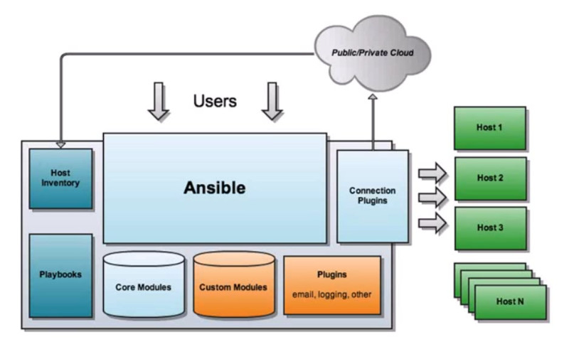

## 1.ansible介绍

1. 简介:
    + ansible是一种自动化运维工具，基于Python开发，集合了众多运维工具（puppet、cfengine、chef、func、fabric）的优点，实现了批量系统配置、批量程序部署、批量运行命令等功能。
    + ansible是基于模块工作的，本身没有批量部署的能力。真正具有批量部署的是ansible所运行的模块，ansible只是提供一种框架。
    
2. 特性:
    + 有Paramiko，PyYAML，Jinja2（模板语言）三个关键模块;
        + Paramiko模块是一个围绕ssh网络概念的纯pythion接口;
        + PyYAML模块是一种文件数据处理格式，常用语生成，解析或修改YAML配置文件;
        + Jinja2是基于Python的模板引擎;
    + 部署简单，基于python和SSH(默认已安装)，agentless
    + 默认使用SSH协议:
        + 基于密钥认证;
        + 在inventory文件中指定账号和密码;
    + 主从模式:
        + master: ansible, ssh client
        + slave: ssh server
    + 支持自定义模块
        + 可使用任何编程语言写模块;
    + 支持playbook编排任务
    + 幂等性:
        + 一个任务执行1遍和执行n遍效果一样，不因重复执行带来意外情况;
    + 模块化:
        + 调用特定的模块，完成特定任务;
        
3. 架构:

    
    + 由以下几个核心组件构成:
        + ansible（主体）
            + ansible的核心程序，提供一个命令行接口给用户对ansible进行管理操作；
        + Host Inventory（主机清单）
            + 为Ansible定义了管理主机的策略。一般小型环境下我们只需要在host文件中写入主机的IP地址即可，但是到了中大型环境我们有可能需要使用静态inventory或者动态主机清单来生成我们所需要执行的目标主机。
        + Core Modules（核心模块）
            + Ansible执行命令的功能模块，多数为内置的核心模块。
        + Custom Modules（拓展模块）
            + 如果ansible自带的模块无法满足我么你的需求，用户可自定义相应的模块来满足自己的需求。
        + Playbook（任务剧本）
            + 编排定义ansible任务集的配置文件，由ansible顺序依次执行，通常是JSON格式的* YML文件
        + Connection Plugins（连接插件）
            + 模块功能的补充，如连接类型插件、循环插件、变量插件、过滤插件等，该功能不常用
            
4. 安装: 
    + CentOS7安装ansible
        + yum install -y epel-release （依赖于epel源）
        + yum install ansible -y
        
    + 查看版本:
        + ansible --version
        
    + 配置文件: /etc/ansible/ansible.cfg
    + Inventory: /etc/ansible/hosts
    
    + 如何查看模块帮助
        + ansible-doc -l
        + ansible-doc -s MODULE_NAME
        
    + 语法: 
        + ansible <host-pattern> [options]
            + -f forks: 启动的并发线程数
            + -m module_name: 要使用的模块
            + -a args: 模块特有的参数
        
5. 简单应用:
    + 场景: 执行远程节点 查询时间 命令
        + ansible主机: 192.168.1.200
        + 远程操作节点: 192.168.1.201
    + 操作: 
        + 在ansible主机的主机清单（/etc/ansible/hosts）中配置192.168.1.201节点
        + 使用ssh协议(基于密钥认证):
            ```bash
            ssh-keygen -t rsa
            ssh-copy-id -i /root/.ssh/id_rsa.pub root@192.168.1.201
            ```
        + 执行ansible命令:
            ```bash
            ansible 192.168.1.201 -m command -a 'date'
            ```