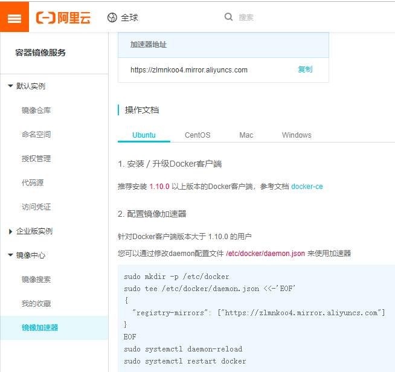

## docker镜像加速器

1. 配置Docker镜像加速器
    + 国内从Docker Hub拉取镜像的速度很慢且容易报错，此时，可以配置镜像加速器。Docker官方和国内很多云服务商都提供了国内加速服务，例如:
        + Docker官方的中国镜像加速器：https://registry.docker-cn.com  不用注册
        + 中科大的镜像加速器：https://docker.mirrors.ustc.edu.cn/   不用注册
        + 阿里云的镜像加速器：登录阿里云的容器hub服务，镜像加速器那一栏里会为你独立分配一个加速器地址 要注册
        + DaoCloud的镜像加速器：登录DaoCloud的加速器获取脚本，该脚本可以将加速器添加到守护进程的配置文件中 要注册
    + 基于Ubuntu 16.04+、Debian 8+、CentOS7
        + 对于使用systemd的系统，请在/etc/docker/daemon.json中写入如下内容(如果文件不存在请新建该文件)
        ``` shell 
        vim /etc/docker/daemon.json
        
        {
        "registry-mirrors": ["https://registry.docker-cn.com"]
        }
        
        # 重新启动服务
        systemctl daemon-reload
        systemctl restart docker
        ```
    + 阿里云的镜像加速器(推荐)
        + https://cr.console.aliyun.com/cn-hangzhou/instances/mirrors
        