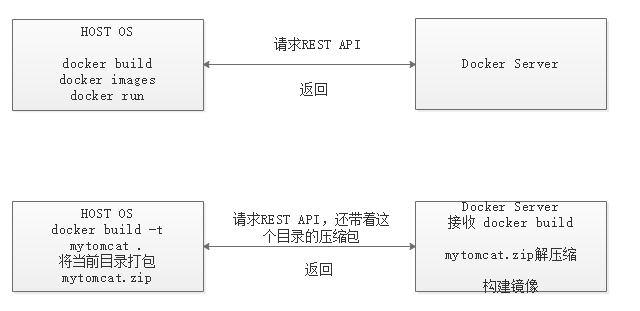

## 5.dockerfile定制镜像

1. 基本指令
    + FROM: 指定基础镜像
    + RUN: 执行命令
    + COPY: 复制命令
    + ADD: 复制命令，功能比COPY强
        + 从 url 拷贝文件到镜像中
        + 如果<源路径>为一个tar压缩文件的话，压缩格式为gzip，bzip以及xz的情况下，ADD指定将会自动解压缩文件到<目标路径>，并且解压完成后会自动删除该压缩文件
        + 因此在COPY和ADD指令中选择的时候，可以遵循这样的原则，所有的文件复制均使用COPY指令；仅在需要使用自动解压缩的场合使用ADD指令
    + WORKDIR 指定工作目录
    + EXPOSE: 声明运行时容器提供服务的端口
    + CMD: 指定容器主进程的启动命令
    + ENV: 设置环境变量
    + 示例:
        ``` shell 
        FROM tomcat
        # 指定工作目录
        WORKDIR /usr/local/tomcat/webapps/ROOT
        # 清空工作目录下所有文件
        RUN rm -rf *
        # 将上下文路径中的zip文件复制到工作目录中
        COPY my-shop-1.0.0-SNAPSHOT.zip .
        # 解压缩文件至当前目录
        RUN unzip my-shop-1.0.0-SNAPSHOT.zip .
        # 删除压缩文件
        RUN rm -fr my-shop-1.0.0-SNAPSHOT.zip
        # 将工作目录切换回 /usr/local/tomcat
        WORKDIR /usr/local/tomcat
        ```
2. 定制tomcat镜像
    + 创建目录:
        ``` shell
       cd /usr/local/
       mkdir docker
       cd docker
       mkdir tomcat
       cd tomcat
       ```
    + 交互方式进入，查看镜像容器结构:
        ``` shell 
        docker run -it --rm tomcat bash 
        ```
    + 创建Dockerfile文件:
        ``` shell 
        vim Dockerfile
        
        FROM tomcat
        WORKDIR /usr/local/tomcat/webapps/ROOT/
        RUN rm -rf *
        RUN echo "Hello Docker" > /usr/local/tomcat/webapps/ROOT/index.html
        ```
    + 构建镜像mytomcat:
        ``` shell 
        docker build -t mytomcat .
        ```
    + 运行镜像mytomcat:
        ``` shell 
        docker run -p 8080:8080 mytomcat
        ```
3. 镜像构建上下文: context  
    + 如果注意，会看到 docker build 命令最后有一个 . 。
    + . 表示当前目录，而 Dockerfile就在当前目录，因此不少初学者以为这个路径是在指定 Dockerfile 所在路径，这么理解其实是不准确的。如果对应上面的命令格式，你可能会发现，这是在指定上下文路径。那么什么是上下文呢？
    + docker build 命令构建镜像，其实并非在本地构建，而是在服务端，也就是 Docker 引擎中构建的。
    + 当构建的时候，用户会指定构建镜像上下文的路径， docker build 命令得知这个路径后，会将路径下的所有内容打包，然后上传给 Docker 引擎。这样Docker 引擎收到这个上下文包后，展开就会获得构建镜像所需的一切文件。
    + 一般来说，应该会将 Dockerfile 置于一个空目录下，或者项目根目录下。如果该目录下没有所需文件，那么应该把所需文件复制一份过来。如果目录下有些东西确实不希望构建时传给 Docker 引擎，那么可以用 .gitignore 一样的语法写一个 .dockerignore ，该文件是用于剔除不需要作为上下文传递给 Docker 引擎的。
    


