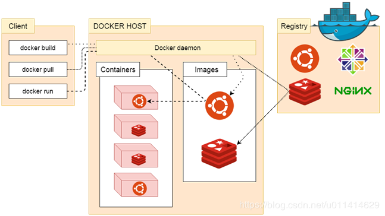

## 4.docker-架构

1. Docker使用客户端/服务器(C/S)架构模式, 使用远程API来管理和创建Docker容器

2. Docker容器通过Docker镜像来创建

3. 容器与镜像的关系类似于面向对象编程中对象与类。

| Docker | 面向对象 |
| :---- | :---- |
| 镜像 | 类 |
| 容器 | 对象 |

| 标题 | 说明 |
| :---- | :---- |
| 镜像(Images) | Docker镜像是用于创建Docker容器的模板。 |
| 容器(Container) | 容器是独立运行的一个或一组应用。 |
| 客户端(Client) | Docker客户端通过命令行或者其他工具使用Docker API与Docker的守护进程进行通信。 |
| 主机(Host) | 一个物理或者虚拟的机器，用于执行Docker守护进程和容器。 |
| 仓库(Registry) | Docker仓库用来保存镜像，可以理解为代码控制中的代码仓库。[Docker Hub](https://hub.docker.com)提供了庞大的镜像集合供使用。 |
| Docker Machine | Docker Machine是一个简化Docker安装的命令行工具，通过一个简单的命令即可在相应的平台上安装Docker,比如VirtualBox、Digital Ocean、Microsoft Azure。 |