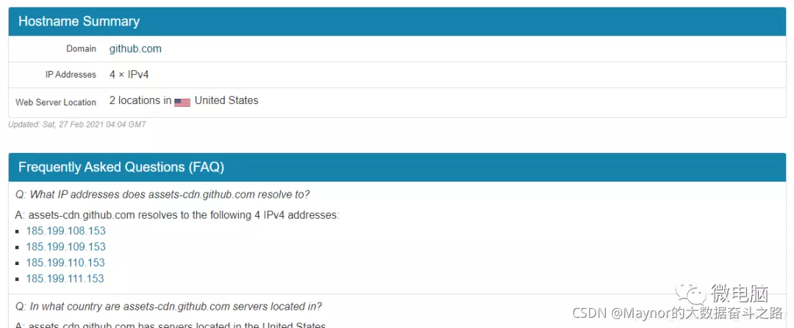

## 1.github打开很慢或者打不开的解决办法

#### 一. 转载网页

https://blog.csdn.net/xianyu120/article/details/120645285

#### 二. 转载内容

Github作为全球最大的同性交友网站，在国内使用时总存在着打不开或者打开慢的问题。可以确定的是，GitHub并没有被墙，所以可以定位问题为域名解析服务器连接不上。这篇文章给出出现这种问题的解决办法。

解决办法

我们将GitHub网站所用到的几个IP地址写到我们电脑的hosts文件中就可以了，IP不止GitHub主站IP，还有静态资源等内容的IP。我们主要用到下面几个网站进行查询：

1. github.com IP地址查询
    * GitHub的主站IP可以通过这个网址进行查询：https://github.com.ipaddress.com/
    * 其中的IP Address就是我们需要的内容，将这一行内容添加到hosts文件中：140.82.113.4 github.com


2. github.global.ssl.fastly.net IP地址查询
    * 可以通过这个网址进行查询：https://fastly.net.ipaddress.com/github.global.ssl.fastly.net
    * 其中的IP Address就是我们需要的内容，将这一行内容添加到hosts文件中：199.232.69.194 github.global.ssl.fastly.net


3. assets-cdn.github.com IP地址查询
    * 可以通过这个网址进行查询：https://github.com.ipaddress.com/assets-cdn.github.com
    * 其中的IP Address就是我们需要的内容，将这几行内容添加到hosts文件中：
        185.199.108.153 assets-cdn.github.com
        185.199.109.153 assets-cdn.github.com
        185.199.110.153 assets-cdn.github.com
        185.199.111.153 assets-cdn.github.com



4. 总结
    * Windows10快速打开hosts文件在这个位置：(C:\WINDOWS\system32\drivers\etc)
    * 修改后的hosts文件末尾加上了这几行：
```sh
# 以下内容为2021-11-28日查询结果
140.82.112.3 github.com
199.232.69.194 github.global.ssl.fastly.net
185.199.108.153 assets-cdn.github.com
185.199.109.153 assets-cdn.github.com
185.199.110.153 assets-cdn.github.com
185.199.111.153 assets-cdn.github.com
```
    * 刷新DNS缓存：Windows打开cmd，输入 ipconfig/flushdns
    * 如果还是无法打开，只能尝试使用github镜像网站
        * https://github.com.cnpmjs.org
        * https://hub.fastgit.org 

5. 方法二
    - 百度搜索’查询网址dns,或者’可以直接输入网址： https://tool.chinaz.com/dns/
    - http://tool.chinaz.com/dns?type=1&host=github.com&ip=
    - 检测https://github.com得到响应IP,添加IP到hosts文件中
        - windows C:\Windows\System32\drivers\etc\hosts
        - Mac 在Finder中同时按“Shift”“Command”“G”三个键，输入“/etc/hosts”
        - linux /etc/hosts
```sh
# 方法一直接修改hosts文件,添加下面IP到文件中
52.192.72.89 github.com
203.208.39.99 github.com
```