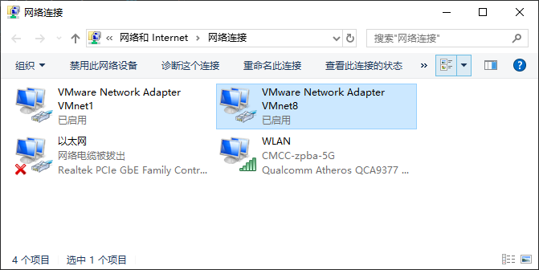

## 6.给Ubuntu 16.04虚拟机桥接模式分配静态ip

1. 查看是否配有VMnet8  
    

2. 查看主机给VMnet8网卡分配的IP:
    ```shell 
    ipconfig命令执行结果如下:
    
    以太网适配器 VMware Network Adapter VMnet8:
    
       连接特定的 DNS 后缀 . . . . . . . :
       本地链接 IPv6 地址. . . . . . . . : fe80::8d09:d774:fdd9:4729%15
       IPv4 地址 . . . . . . . . . . . . : 192.168.1.1 ## TODO 这个IP就是虚拟机配置静态IP时的网关，记住！！！！！！！这点很重要。
       子网掩码  . . . . . . . . . . . . : 255.255.255.0
       默认网关. . . . . . . . . . . . . :
    
    无线局域网适配器 WLAN:
    
       连接特定的 DNS 后缀 . . . . . . . :
       IPv6 地址 . . . . . . . . . . . . : 2409:8a1e:a9a1:5e30:2c50:e313:a117:da69
       临时 IPv6 地址. . . . . . . . . . : 2409:8a1e:a9a1:5e30:e167:8618:ebe6:2aaa
       本地链接 IPv6 地址. . . . . . . . : fe80::2c50:e313:a117:da69%11
       IPv4 地址 . . . . . . . . . . . . : 192.168.1.9
       子网掩码  . . . . . . . . . . . . : 255.255.255.0
       默认网关. . . . . . . . . . . . . : fe80::50a1:c4ff:fee3:1564%11
                                           192.168.1.1
    ```
    
3. 进行虚拟机配置文件设置:
    ``` shell 
    1. vim /etc/network/interfaces
    执行结果如下: 
    # This file describes the network interfaces available on your system
    # and how to activate them. For more information, see interfaces(5).
    
    source /etc/network/interfaces.d/*
    
    # The loopback network interface
    auto lo
    iface lo inet loopback
    
    # The primary network interface
    auto ens33
    iface ens33 inet static
    address 192.168.1.101
    netmask 255.255.255.0
    network 192.168.1.0
    broadcast 192.168.1.255
    gateway 192.168.1.1
    # dns-* options are implemented by the resolvconf package, if installed
    dns-nameservers 114.114.114.114 8.8.8.8 192.168.1.1
    dns-search zhanghui
    
    2. 重启networking服务: /etc/init.d/networking restart
    
    3. 重启: reboot
    ```