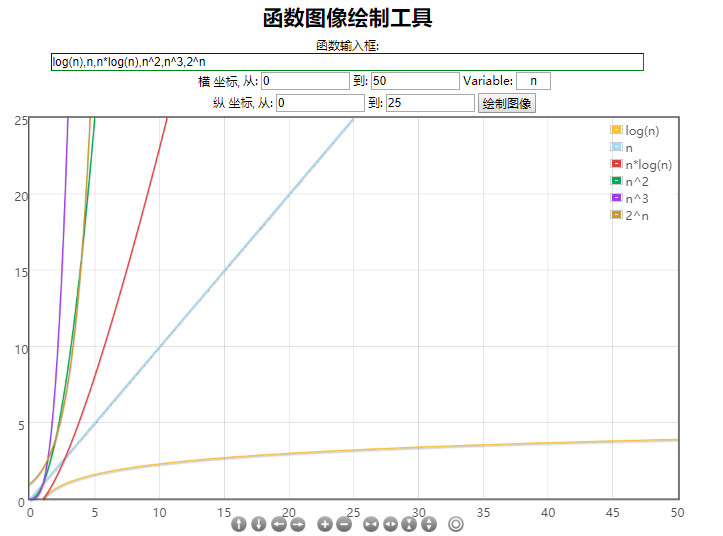

## 03.大O表示法

1. 一般用大O表示法来描述复杂度，它表示的是数据规模 n 对应的复杂度

2. 忽略常数、系数、低阶
    + $9 >> O(1)$
    + $2n + 3 >> O(n)$
    + $n^2 + 2n + 6 >> O(n^2)$
    + $4n^3 + 3n^2 + 22n + 100 >> O(n^3)$
    + 注意：大O表示法仅仅是一种粗略的分析模型，是一种估算，能帮助我们短时间内了解一个算法的执行效率

3. 对数阶一般省略底数
    + $log_2{n} = log_2{9} * log_9{n}$
    + 所以$log_2{n}、log_9{n}$统称为$log{n}$
    
4. 常见的复杂度

| 执行次数 | 复杂度 | 非正式术语 |
| :----: | :----:| :----: |
| $12$ | $O(1)$| 常数阶 |
| $2n + 3$ | $O(n)$| 线性阶 |
| $4n^2 + 2n + 6$ | $O(n^2)$| 平方阶 |
| $4log_2{n} + 25$ | $O(log{n})$ | 对数阶 |
| $3n + 2nlog_3{n} + 15$ | $O(nlog{n})$| $nlog{n}$阶 |
| $4n^3 + 3n^2 + 22n + 100$ | $O(n^3)$| 立方阶 |
| $2^n$ | $O(2^n)$| 指数阶 |

$O(1) < O(log{n}) < O(n) < O(nlog{n}) < O(n^2) < O(n^3 ) < O(2^n) < O(n!) < O(n^n)$

5. 可以借助[函数生成工具](https://zh.numberempire.com/graphingcalculator.php)对比复杂度的大小

