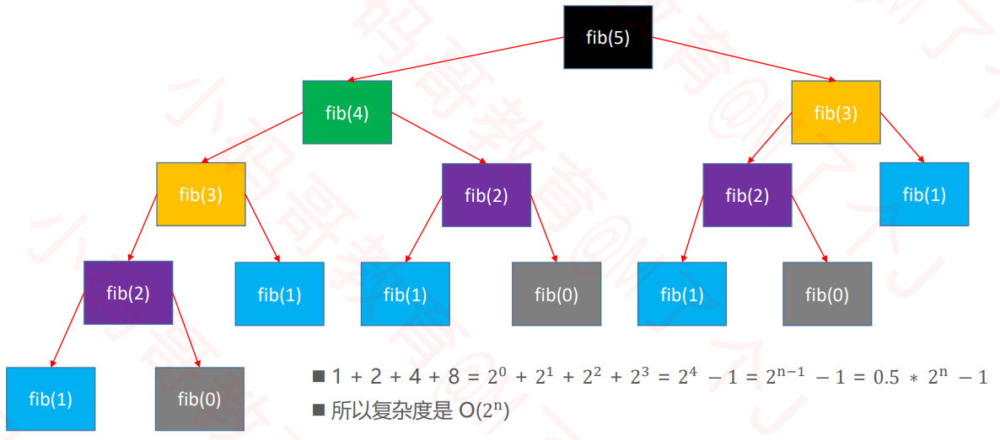

## 4.fib函数的时间复杂度分析

1. fib函数的时间复杂度: $O(2^n)$
    + fib函数:
        ```java 
        prifib2函vate static int fib(int n) {
            if (n <= 1) {
                return n;
            }
            return fib(n - 1) + fib(n - 2);
        }
        ```
    + 时间复杂度分析:
        
        
2. 数的时间复杂度: $O(n)$
    + fib2函数:
    ```java 
    private static int fib2(int n) {
        if (n <= 1) {
         return n;
        }
        // 0 1 2 3 4 5 6
        // 0 1 1 2 3 5 8
        int first = 0;
        int second = 1;
        for (int i = 0; i < n - 1; i++) {
            int sum = first + second;
            first = second;
            second = sum;
        }
        return second;
    }
    ```
    
3. 他们的差别有多大？
    + 如果有一台1GHz的普通计算机，运算速度 $10^9$ 次每秒（ n 为 64 ）
    + O(n) 大约耗时 $6.4 ∗ 10^{−8}$ 秒
    + $O(2^n)$ 大约耗时 584.94 年
    + 有时候算法之间的差距，往往比硬件方面的差距还要大
    
4. 算法的优化方向
    + 用尽量少的存储空间
    + 用尽量少的执行步骤（执行时间）
    + 根据情况，可以
        + 空间换时间
        + 时间换空间