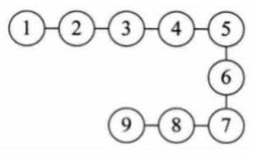
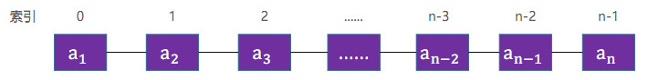
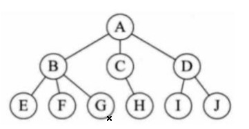
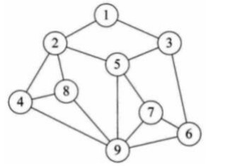

## 01-什么是数据结构

1. 数据结构是计算机存储、组织数据的方式；在实际应用中，根据使用场景来选择最合适的数据结构；

2. 线性结构
    + 线性表  
    
    
    + 线性表是具有 n 个相同类型元素的有限序列（ n ≥ 0）  
      
        + $a_1$ 是首节点（首元素）， $a_n$ 是尾结点（尾元素）
        + $a_1$ 是 $a_2$ 的前驱， $a_2$ 是 $a_1$ 的后继
    
    + 常见的线性表
        + 数组
        + 链表
        + 栈
        + 队列
        + 哈希表(散列表)
    
3. 树形结构
    + 二叉树 AVL树、红黑树 B树、堆、Trie 哈夫曼树、并查集  
    
    
4. 图形结构
    + 邻接矩阵 邻接表  
    
