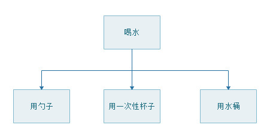

## 02.策略模式

### 意图

定义一系列的算法,把它们一个个封装起来, 并且使它们可相互替换。

### 理解策略模式

为了更好的理解策略模式，我们举个例子，比如人们喝水，可以选择不能的器物。我们选择不同的方式，结果都是一样的，能喝到水。



### 实现策略模式

策略模式把对象本身和运算规则区分开来，因此我们整个模式也分为三个部分。

+ 环境类(Context):用来操作策略的上下文环境，也就是 人。
+ 抽象策略类(Strategy):策略的抽象，喝水方式的抽象
+ 具体策略类(ConcreteStrategy):具体的策略实现，每一种方式的具体实现。

1. 定义抽象策略接口

```java
/**
 * <p>
 * 定义抽象策略接口
 * </p>
 */
public interface DrinkStrategy {
    void drink();
}
```

2. 具体策略类

```java
/**
 * <p>
 * 用勺子喝水
 * </p>
 */
public class ScoopStrategy implements DrinkStrategy {
    @Override
    public void drink() {
        System.out.println("用勺子喝水");
    }
}

/**
 * <p>
 *  用一次性杯子喝水
 * </p>
 */
public class CupStrategy implements DrinkStrategy {
    @Override
    public void drink() {
        System.out.println("用一次性杯子喝水");
    }
}

/**
 * <p>
 * 用水桶喝水
 * </p>
 */
public class BucketStrategy implements DrinkStrategy {
    @Override
    public void drink() {
        System.out.println("用水桶喝水");
    }
}
```

3. 环境类实现

```java
/**
 * <p>
 * 环境类实现
 * </p>
 */
public class Person {
    /**
     * 策略接口
     */
    DrinkStrategy drinkStrategy;

    /**
     * 设置喝水策略
     */
    public void setDrinkStrategy(DrinkStrategy drinkStrategy) {
        this.drinkStrategy = drinkStrategy;
    }

    /**
     * 为该人员设置喝水策略
     */
    public void executeStrategy() {
        drinkStrategy.drink();
    }

}
```

4. 测试

```java
/**
 * <p>
 * 测试类
 * </p>
 */
public class Test {
    public static void main(String[] args) {
        Person person = new Person();
        // 设置策略
        /// person.setDrinkStrategy(new ScoopStrategy());
        /// person.setDrinkStrategy(new CupStrategy());
        person.setDrinkStrategy(new BucketStrategy());
        person.executeStrategy();
    }
}
```

### 补充说明

1. 优点： 

    + 算法可以自由切换。 
    + 避免使用多重条件判断。
    + 扩展性良好。

2. 缺点： 

    + 策略类会增多。
    + 所有策略类都需要对外暴露。

3. 注意事项：

    + 如果一个系统的策略多于四个，就需要考虑使用混合模式，解决策略类膨胀的问题。
