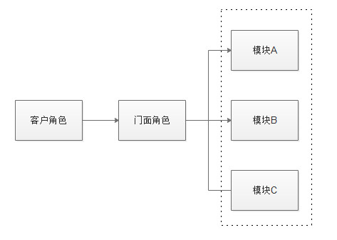

## 04.门面模式

### 意图

为子系统中的一组接口提供一个一致的界面，外观模式定义了一个高层接口，这个接口使得这一子系统更加容易使用。

### 理解门面模式


简单来说，该模式就是把一些复杂的流程封装成一个接口供给外部用户更简单的使用。这个模式中，设计到3个角色。

+ 子系统角色：实现了子系统的功能。它内部可以有系统内的相互交互。
+ 门面角色：外观模式的核心。它被客户角色调用，它熟悉子系统的功能。内部根据客户角色的需求预定了几种功能的组合。
+ 客户角色：通过调用门面角色来完成要实现的功能。

### 实现门面模式

```java
/**
 * <p>
 * 1. 创建一个接口
 * </p>
 */
public interface Shape {
    void draw();
}

/**
 * <p>
 * 2. 创建实现接口的实体类
 * </p>
 */
public class Rectangle implements Shape {
    @Override
    public void draw() {
        System.out.println("画出长方形...");
    }
}

public class Square implements Shape {
    @Override
    public void draw() {
        System.out.println("画出正方形...");
    }
}

public class Circle implements Shape {
    @Override
    public void draw() {
        System.out.println("画出圆形...");
    }
}

/**
 * <p>
 * 3. 创建一个外观类
 * </p>
 */
public class ShapeMaker {
    private Shape circle;
    private Shape rectangle;
    private Shape square;

    public ShapeMaker() {
        circle = new Circle();
        rectangle = new Rectangle();
        square = new Square();
    }

    public void drawCircle() {
        circle.draw();
    }

    public void drawRectangle() {
        rectangle.draw();
    }

    public void drawSquare() {
        square.draw();
    }

    public void drawAll() {
        System.out.println("1. 先画圆形...");
        circle.draw();
        System.out.println("2. 再画长方形...");
        rectangle.draw();
        System.out.println("3. 最后正方形...");
        square.draw();
    }
}

/**
 * <p>
 * 4. 测试
 * </p>
 */
public class Test {
    public static void main(String[] args) {
        ShapeMaker shapeMaker = new ShapeMaker();
        // shapeMaker.drawCircle();
        // shapeMaker.drawRectangle();
        shapeMaker.drawSquare();
        shapeMaker.drawAll();
    }
}
```