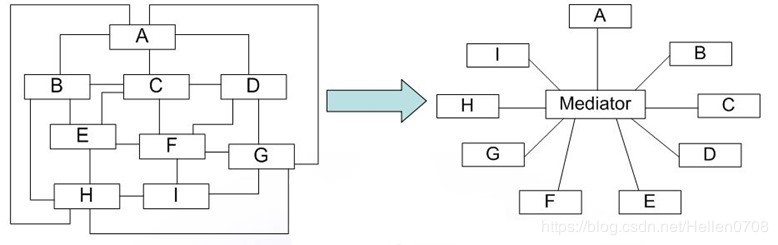

## 05.调停者模式

### 意图

用一个中介对象来封装一系列的对象交互，中介者使各对象不需要显式地相互引用，从而使其耦合松散，而且可以独立地改变它们之间的交互。

### 理解调停者模式


调停者模式包括以下角色：
+ 抽象中介者(Mediator): 定义了同事对象到中介者对象之间的接口。
+ 具体中介者(ConcreteMediator): 实现抽象中介者的方法，它需要知道所有的具体同事类，同时需要从具体的同事类那里接收信息，并且向具体的同事类发送信息。
+ 抽象同事类(Colleague): 定义了中介者对象的接口，它只知道中介者而不知道其他的同事对象。
+ 具体同事类(ConcreteColleague) : 每个具体同事类都只需要知道自己的行为即可，但是他们都需要认识中介者。


### 实现调停者模式

```java
/**
 * <p>
 * 1. 同事抽象类
 * </p>
 */
public abstract class Colleague {

    /**
     * 中介者抽象类
     */
    protected Mediator mediator;

    /**
     * 接受消息
     */
    public abstract void receive();

    /**
     * 发送消息
     */
    public abstract void send();

    public void setMediator(Mediator mediator) {
        this.mediator = mediator;
    }
}

/**
 * <p>
 * 2. 中介者抽象类
 * </p>
 */
public abstract class Mediator {

    /**
     * 注册同事
     */
    abstract void register(Colleague colleague);

    /**
     * 通知中介者，发送消息
     */
    abstract void relay(Colleague colleague);
}

/***
 * 3. 中介者实现类
 */
public class ConcreteMediator extends Mediator {

    /**
     * 被中介者代理的同事
     */
    private List<Colleague> colleagues;

    public ConcreteMediator() {
        colleagues = new ArrayList<>();
    }

    @Override
    public void register(Colleague colleague) {
        if (!colleagues.contains(colleague)) {
            colleague.setMediator(this);
            this.colleagues.add(colleague);
        }
    }

    @Override
    public void relay(Colleague colleague) {
        colleagues.forEach(c -> {
            if (!c.equals(colleague)) {
                c.receive();
            }
        });
    }
}

/***
 * 4. 具体的同事类1
 */
public class ConcreteColleague1 extends Colleague {
    @Override
    public void receive() {
        System.out.println("具体同事类1收到请求。");
    }

    @Override
    public void send() {
        System.out.println("具体同事类1发出请求。");
        // 请中介者转发
        this.mediator.relay(this);
    }
}

/***
 * 5. 具体的同事类2
 */
public class ConcreteColleague2 extends Colleague {
    @Override
    public void receive() {
        System.out.println("具体同事类2收到请求。");
    }

    @Override
    public void send() {
        System.out.println("具体同事类2发出请求。");
        // 请中介者转发
        this.mediator.relay(this);
    }
}

/**
 * <p>
 * 6. 测试
 * </p>
 */
public class Test {

    public static void main(String[] args) {
        // 构建中介者
        Mediator mediator = new ConcreteMediator();

        // 构建具体的同事类
        Colleague colleague1 = new ConcreteColleague1();
        Colleague colleague2 = new ConcreteColleague2();

        // 注册同事
        mediator.register(colleague1);
        mediator.register(colleague2);

        // 发送消息
        colleague1.send();
        colleague2.send();
    }
}
```